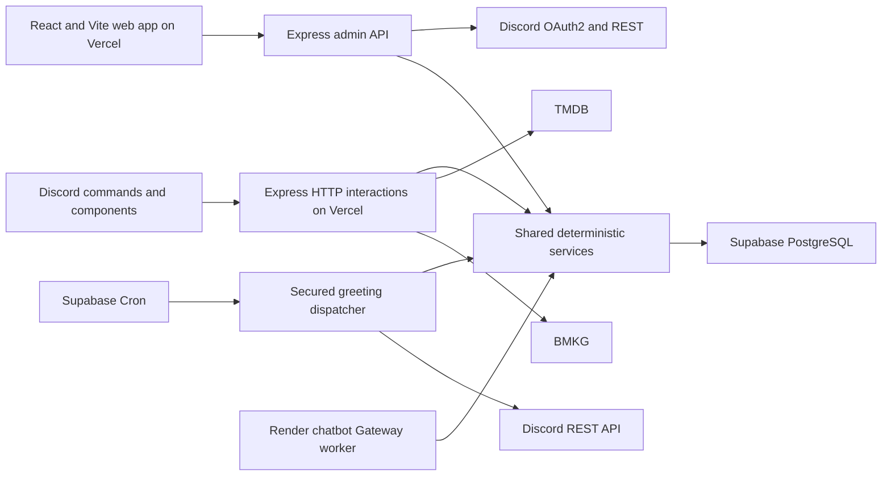

# Leone Product Requirements Document

| Field | Value |
|---|---|
| Product | Leone — Leonore Kingdom's Discord companion and administration platform |
| Status | Proposed for owner review |
| PRD version | 1.1 |
| Product owner | Leonore |
| Created | 2026-08-03 |
| Review date | 2026-08-10 |
| Initial scope | Leonore's Kingdom only |
| Public web origin | `https://bots.leonorekingdom.xyz` |

## 1. Executive decision

Evolve Leone from a local, single-process Discord bot into a small community platform with three cooperating surfaces:

1. **Discord bot:** member commands, consent flows, recommendations, and staff-triggered actions.
2. **Web application:** Discord-authenticated member family trees and role-authorized administration.
3. **Supabase PostgreSQL:** durable relationship, configuration, schedule, session, and audit data.

The approved implementation direction is **React + Vite**, an **Express.js API**, and **Supabase PostgreSQL**, deployed free-first on **Vercel** with **Cloudflare DNS**. Slash commands, buttons, OAuth, admin APIs, health checks, and scheduler dispatch remain on Vercel. Interactive chat is isolated in a Render Background Worker using Discord Gateway events and Groq-backed retrieval-augmented generation (RAG).

The next release must preserve the current deterministic permission and privacy model. Relationship lore never grants Discord authority, and no administrative action may rely on an LLM, hidden Discord command, or client-side web check.

The delivery should remain incremental. A full rewrite, microservice fleet, Redis deployment, multi-agent system, and multi-guild support would add risk without solving a current requirement.

## 2. Product vision

Leone is the royal companion and community operating system for Leonore's Kingdom: warm, concise, bilingual where useful, and grounded in the server's identity of talent, growth, belonging, gaming, and a safer community.

The administration platform should make the bot understandable and controllable without exposing secrets or bypassing Discord permissions. The relationship system should feel playful like Koya's family experience while being more explicit about consent, privacy, data deletion, and structurally valid family graphs.

## 3. Current implementation baseline

The repository currently uses CommonJS JavaScript, Node.js, `discord.js`, `dotenv`, the Discord Gateway, and Node's built-in test runner.

Registered command areas and commands:

- Utilities: `/ping`, `/help`
- Kingdom: `/about`, `/staff`, `/server-map`, `/rules`, `/server`
- Relationships: `/bonds`
- Recommendations: `/recommend movie`
- Automation: `/morning`

Current strengths:

- Commands are grouped by feature area and self-register help metadata.
- Bonds already uses a service/store boundary, reciprocal consent, privacy settings, blocking, cycle prevention, export, and deletion.
- Movie recommendations use TMDB through an isolated client.
- Morning greetings use an isolated BMKG client, deterministic quote selection, permission checks, safe role mentions, and a neutral fallback.
- Automated tests cover command registration, Discord limits, Bonds behavior, TMDB behavior, and greeting behavior.

Current constraints:

- [`JsonBondStore`](../src/features/relationships/bond-store.js) persists production-shaped relationship data to one local JSON file and is safe only for one process.
- `/bonds accept` and `/bonds decline` require an internal request UUID copied from `/bonds pending`.
- `/bonds tree` is a text embed, not an interactive family visualization.
- `/morning` is named for one time of day and supports manual delivery only.
- [`src/index.js`](../src/index.js) runs Gateway interactions in one process with no HTTP interaction, health, or admin API server.
- There is no database migration system, web authentication, dashboard, deployment manifest, production health check, or backup/restore runbook.

## 4. Goals

### G-07 — Interactive public chatbot

Add a bounded Leone chat experience for direct mentions in owner-approved public
channels and DMs. The first provider is Groq through its OpenAI-compatible API.
The worker uses RAG over canonical server documents and new redacted messages
from approved channels; it performs no historical backfill and never executes
moderation or server-administration tools.

The chatbot stores only versioned canonical documents, redacted rolling message
chunks (7/14/30-day retention), and operational usage metadata. Supabase
PostgreSQL full-text search is the initial retrieval mechanism; embeddings are a
later, measured optimization. Admins control enablement, channel allowlist,
trigger mode, retention, cooldown, daily quota, model, reindex, and purge from
the Chatbot page. Vercel serves these controls; Render runs `node
src/chat-worker.js`.

### G-01 — Durable data

Move Bonds and all new mutable configuration into PostgreSQL without losing current user data, privacy, or deletion behavior.

### G-02 — Better relationship UX

Allow members to accept or decline a request by selecting the requesting Discord member rather than copying a request ID. Provide an interactive, privacy-aware family tree.

### G-03 — General greetings

Rename Morning to Greetings, support multiple occasions, preserve manual preview/send, and add an explicitly opt-in scheduler.

### G-04 — Safe administration

Provide an authenticated web application for bot status, configuration, greeting schedules, templates, run history, and restricted operational tools.

### G-05 — Reproducible deployment

Deploy the React/Vite application and Express API to Vercel under `bots.leonorekingdom.xyz`, with Supabase migrations/scheduling, Cloudflare-managed DNS, health checks, logs, backups, and rollback.

### G-06 — Free-first operation

Keep the initial infrastructure at zero cost when practical, while documenting the reliability limitations and a low-cost paid fallback.

## 5. Non-goals for this program increment

- Multi-guild SaaS behavior or public bot installation
- Autonomous moderation or punishment
- Passive collection of message content
- Autonomous administrative actions through an LLM
- Native mobile application
- Payments, subscriptions, advertisements, or monetization
- Redis, BullMQ, Kubernetes, or microservices before demonstrated need
- Staff creation or alteration of member relationships without member consent
- Publicly indexable family trees
- A full rewrite of all working commands before feature delivery

## 6. Users and authorization

| Persona | Needs | Authorization source |
|---|---|---|
| Member | Request and manage bonds, view permitted trees, control privacy, export/delete data | Authenticated Discord user and guild membership |
| Greeting manager | Preview, send, and manage greeting schedules/templates | Configured Discord role ID with an approved capability |
| Moderator | Inspect failures and abuse reports without browsing unrelated private bonds | Configured Discord role ID with limited capability |
| Administrator | Configure channels, roles, integrations, schedules, and operational settings | Configured Discord role ID with admin capability |
| Owner | Full configuration, role mapping, emergency disable, export, and rollback controls | Live Discord guild owner ID |

Rules:

- Authorization uses immutable Discord user and role IDs, not usernames or role names.
- Leonore's ownership is verified against the live guild owner ID.
- Leanne or any other person receives dashboard access only through a configured current Discord role or explicit owner grant.
- The backend re-checks authorization on every request and consequential action.
- The browser never receives the Discord bot token, client secret, database credentials, or raw OAuth refresh token.

## 7. Functional requirements

### 7.1 Discord authentication and web sessions

| ID | Requirement | Acceptance evidence |
|---|---|---|
| AUTH-01 | Users sign in through Discord OAuth2 Authorization Code flow. | Successful login and callback test |
| AUTH-02 | Request only `identify` and `guilds.members.read` unless another scope is separately approved. | OAuth URL and scope review |
| AUTH-03 | Access is denied when the user is no longer a member of the configured guild. | Revoked-membership test |
| AUTH-04 | The backend maps current Discord role IDs to Leone capabilities on every session refresh. | Role removal test |
| AUTH-05 | Sessions use secure, HTTP-only, same-site cookies and rotate after login. | Security integration test |
| AUTH-06 | State-changing web requests require CSRF protection and an audit event. | CSRF and audit tests |

Discord documents `identify` for the user's identity and `guilds.members.read` for the current user's guild-member record. Bot credentials remain separate from user OAuth credentials. See [Discord OAuth2 and permissions](https://docs.discord.com/developers/platform/oauth2-and-permissions) and [Discord user resource](https://docs.discord.com/developers/resources/user).

### 7.2 Leone Bonds database migration

| ID | Requirement | Acceptance evidence |
|---|---|---|
| BOND-01 | PostgreSQL becomes the production source of truth for profiles, blocks, requests, and accepted bonds. | Repository integration tests |
| BOND-02 | Existing JSON data can be imported once without changing Discord IDs, types, timestamps, expiry, visibility, or block lists. | Dry-run and checksum report |
| BOND-03 | The import is idempotent and runs inside a transaction. | Repeated-import test |
| BOND-04 | All Discord snowflakes are stored as text, never JavaScript numbers. | Schema inspection |
| BOND-05 | Duplicate pending requests and duplicate accepted edges are prevented by database constraints plus service validation. | Concurrency test |
| BOND-06 | Parent and mentor cycles remain impossible. | Graph validation tests |
| BOND-07 | Declined and expired requests are removed; deleted relationship history is not retained. | Retention test |
| BOND-08 | Member export and deletion work from PostgreSQL and cover all server-scoped relationship records. | Export/deletion tests |
| BOND-09 | The JSON file is retained only as a timestamped migration backup and is never written after cutover. | Cutover checklist |

The existing `BondService` should depend on a repository contract rather than knowing whether the backing implementation is JSON or PostgreSQL. Unit tests keep the memory repository; production uses `PostgresBondRepository`.

### 7.3 Mention-based request decisions

The public command contract becomes:

```text
/bonds request member:@member type:<type>
/bonds pending
/bonds accept member:@requester [type:<type>]
/bonds decline member:@requester [type:<type>]
/bonds unlink member:@member [type:<type>]
```

| ID | Requirement | Acceptance evidence |
|---|---|---|
| BOND-10 | `accept` and `decline` use a required Discord user option named `member`; request IDs are not shown to members. | Command payload test |
| BOND-11 | Internal request UUIDs remain in PostgreSQL for uniqueness and debugging but never become the primary member interaction. | Schema and response review |
| BOND-12 | If exactly one incoming request exists from that member, Leone resolves it without requiring a type. | Interaction test |
| BOND-13 | If multiple incoming requests exist from the same member, Leone requires `type` and lists only the ambiguous types. | Ambiguity test |
| BOND-14 | A member cannot accept another member's incoming request. | Authorization test |
| BOND-15 | Acceptance is atomic: the pending request is deleted and the accepted edge is inserted in one transaction. | Transaction failure test |
| BOND-16 | Pending output shows member mentions, relationship types, and expiry, but not internal UUIDs. | Embed test |

Buttons may be added later as a convenience, but mention-based commands remain supported and authoritative.

### 7.4 Family tree visualization

The family-tree experience has two outputs:

1. `/bonds tree` returns a compact Discord summary and a button linking to the authorized web view.
2. `bots.leonorekingdom.xyz/family/:memberId` renders an interactive tree after Discord login.

React Flow is recommended for the web graph because it supports custom nodes, edges, viewport controls, selection, and fit-to-view. See the [React Flow component](https://reactflow.dev/api-reference/react-flow) and [custom-node documentation](https://reactflow.dev/learn/customization/custom-nodes).

| ID | Requirement | Acceptance evidence |
|---|---|---|
| TREE-01 | The graph renders member avatars/display names as nodes and relationship type as labeled edges. | Visual regression screenshot |
| TREE-02 | Parent/child edges use hierarchy direction; partner and sibling edges use distinct visual styles. | Fixture review |
| TREE-03 | Best friend, mentor, rival, and found-family relationships can be toggled so the family hierarchy remains readable. | UI interaction test |
| TREE-04 | Default depth is two hops with a maximum of four and a maximum of 50 visible nodes. | Large-graph test |
| TREE-05 | The API applies Bonds privacy before returning nodes or edges; hidden data is never sent to the browser. | API privacy test |
| TREE-06 | Every visible edge requires the same participant-level visibility decision already enforced by Bonds. | Cross-profile privacy fixtures |
| TREE-07 | Blocked users and erased data disappear from future tree responses. | Block/delete tests |
| TREE-08 | Tree URLs require authentication and are not discoverable through predictable public tokens alone. | Unauthenticated request test |
| TREE-09 | Mobile users can pan, zoom, fit the graph, select a node, and read a text alternative. | Mobile/accessibility test |
| TREE-10 | Staff cannot create, relabel, or delete a bond from the admin dashboard except through a documented abuse-removal workflow with an audit reason. | Authorization test |

Static PNG/SVG generation for Discord is deferred until the authenticated interactive tree is validated. A button and text summary avoid adding a headless-browser dependency to the first free-hosted release.

### 7.5 Admin web application

Routes under the single origin:

```text
https://bots.leonorekingdom.xyz/
https://bots.leonorekingdom.xyz/login
https://bots.leonorekingdom.xyz/family/:memberId
https://bots.leonorekingdom.xyz/admin
https://bots.leonorekingdom.xyz/api/v1/*
https://bots.leonorekingdom.xyz/healthz
```

Admin navigation:

- **Overview:** interaction endpoint health/latency, optional Gateway state, application version, database state, last deployment, and integration health.
- **Greetings:** manual preview/send, templates, quotes, weather locality, schedules, next run, last run, and failures.
- **Discord configuration:** approved guild, channel IDs, role IDs, dashboard capabilities, and command status.
- **Relationships operations:** aggregate counts, failed migrations, reported abuse cases, and user-requested deletion status; no unrestricted private relationship browser.
- **Audit log:** actor, action, target category, result, timestamp, correlation ID, and reason where required.
- **Moderation:** readiness, member actions, moderation cases, optional member DMs, and a configured moderation-log channel.
- **Server administration:** bulk member-role operations, safe role metadata, channel create/edit, and constrained channel archiving.
- **Operations:** maintenance mode, disable all schedules, retry one failed safe operation, and view deployment/runbook links.

| ID | Requirement | Acceptance evidence |
|---|---|---|
| WEB-01 | The dashboard is usable on desktop and mobile. | Responsive visual tests |
| WEB-02 | Read and write capabilities are independently role-mapped. | Capability matrix tests |
| WEB-03 | Every form validates IDs and data server-side. | Invalid-input tests |
| WEB-04 | Consequential actions show the exact channel, role, and content before confirmation. | UI flow test |
| WEB-05 | “Send greeting now,” enable schedule, delete schedule, and emergency disable create audit events. | Audit tests |
| WEB-06 | Secrets are represented only as configured/not configured and cannot be retrieved through the API. | API response scan |
| WEB-07 | The dashboard may perform only explicitly scoped Discord administration: role assignment/metadata and channel create/edit/archive; role permission-bit editing, deletion, reordering, and arbitrary permission-overwrite editing remain unavailable. | Route inventory and hierarchy tests |
| WEB-08 | Health details that reveal infrastructure or IDs require admin authentication; public `/healthz` returns only healthy/unhealthy. | Access test |

Recommended UI/backend stack:

- React + Vite for the web application, built as static assets and deployed on Vercel
- Express.js for the Discord interaction endpoint, OAuth callback, sessions, admin API, internal scheduler endpoint, and health checks
- Supabase PostgreSQL via `pg`, Supavisor transaction pooling at runtime, and versioned SQL migrations deployed with the Supabase CLI
- Shared validation schemas between command, API, and database boundaries
- `discord.js` builders and REST client retained where useful; interaction receipt moves from the Gateway to a signature-verified HTTP endpoint

The admin application and API should use the same Vercel project and origin initially. This avoids unnecessary CORS configuration, a second deployment, and cross-site session complexity. The project builds the React/Vite static output and exposes one `api/index.js` Vercel Function that exports Express; `express.static()` is not used.

### 7.6 Database decision: Supabase PostgreSQL over Firebase

Use **Supabase PostgreSQL** as Leone's system of record. Firebase Cloud Firestore is technically viable and supports transactions, but its document model is a weaker fit for Leone's consent graph, audit trail, schedules, and privacy queries.

| Decision factor | Supabase PostgreSQL | Firebase Cloud Firestore | Leone decision |
|---|---|---|---|
| Relationship constraints | Foreign keys, check constraints, composite uniqueness, transactions, and recursive CTEs | Schemaless documents; uniqueness, graph validity, and denormalized references require more application logic | PostgreSQL |
| Accept/decline flow | Atomically lock a pending request, validate it, create one normalized edge, and delete the request | Atomic transactions exist, but invariants span documents and indexes | PostgreSQL |
| Family-tree traversal | Recursive query with server-side privacy filtering and depth/node caps | Multiple document reads or precomputed/denormalized tree documents | PostgreSQL |
| Schedules and idempotency | Due-job query, row locks, unique occurrence key, and auditable run history | Possible with documents and transactions, but less natural for ordered operational queries | PostgreSQL |
| Admin reporting/export | Joins, aggregate queries, SQL migrations, and standard backup tools | Query patterns must be designed around indexes and denormalized documents | PostgreSQL |
| Realtime UI | Supabase Realtime is available if later justified | Excellent client realtime/offline experience | Not required for the MVP |

The React client must not receive the Supabase database password or `service_role` key. Sensitive reads and every write go through Express authorization. If a future member-facing read uses the Supabase Data API directly, enable and test Row Level Security first; RLS is defense-in-depth, not a replacement for Leone's Discord capability checks.

Supabase Free is suitable for development and an owner-approved beta, not a reliability promise: it currently includes a 500 MB database, has no automatic backups, and low-activity Free projects can pause after seven days. Define the upgrade trigger before production and keep independent logical backups.

### 7.7 Greetings rename and expansion

Because `/morning` has not reached a stable public production contract, replace it directly with grouped `/greetings` commands instead of maintaining a long-lived alias.

Proposed command structure:

```text
/greetings message preview occasion:<morning|afternoon|evening|night|custom> role:@role [location]
/greetings message send occasion:<...> role:@role [location]
/greetings schedule create name:<name> channel:#channel role:@role occasion:<...> time:<HH:mm> [days]
/greetings schedule list
/greetings schedule enable name:<name>
/greetings schedule disable name:<name>
/greetings schedule delete name:<name> confirm:true
```

Discord permits subcommand groups one level deep, which fits the `message` and `schedule` grouping. See [Discord application commands](https://docs.discord.com/developers/interactions/application-commands).

| ID | Requirement | Acceptance evidence |
|---|---|---|
| GREET-01 | Manual preview remains ephemeral and never notifies a role. | Allowed-mentions test |
| GREET-02 | Manual send posts separately and allows only the explicitly selected role mention. | Interaction test |
| GREET-03 | Occasion changes greeting, advice, and quote pool without an LLM. | Template fixtures |
| GREET-04 | BMKG weather remains optional, attributed, timeout-bounded, and failure-tolerant. | Provider failure tests |
| GREET-05 | Schedules are disabled by default and require explicit enable confirmation. | Creation test |
| GREET-06 | Each schedule selects an exact channel ID, recipient role ID, IANA timezone, local time, days, occasion, template, and optional ADM4 locality. | Schema/API test |
| GREET-07 | `Asia/Jakarta` is the default timezone, not a hard-coded UTC offset. | Time calculation tests |
| GREET-08 | The UI and command recommend an opt-in greeting role; `@everyone` is rejected. | Validation test |
| GREET-09 | The dispatcher records at most one delivery for each schedule occurrence. | Restart/concurrency test |
| GREET-10 | A missed occurrence is sent only within a configurable grace period, default 15 minutes; otherwise it is marked missed. | Downtime tests |
| GREET-11 | Disabling a schedule prevents future delivery immediately. | Race test |
| GREET-12 | A global emergency switch disables every scheduled greeting without disabling manual preview. | Operations test |
| GREET-13 | Run history records schedule, occurrence, outcome, Discord message ID, provider status, and error code without storing unnecessary member data. | Data inspection |

BMKG's public forecast API provides JSON forecasts for Indonesian administrative level-IV locations, updates twice daily, and requires visible attribution. See [BMKG's official forecast API](https://data.bmkg.go.id/prakiraan-cuaca/).

### 7.8 Durable scheduling design

For the free-first serverless deployment:

1. Store schedules and their IANA timezone/day/time rules in Supabase PostgreSQL.
2. Configure one Supabase Cron job to invoke `POST /api/internal/greetings/dispatch` once per minute; do not create one provider cron per greeting schedule.
3. Store the dispatcher secret in Supabase Vault and the matching secret in Vercel environment variables. Reject calls without a valid secret and apply a short request timeout.
4. In one short transaction, calculate due occurrences, lock eligible rows with `FOR UPDATE SKIP LOCKED`, and create `greeting_run` rows with a unique `(schedule_id, scheduled_for)` key.
5. Only the request that successfully creates or reclaims an eligible run may send it. Cap the number claimed per invocation so execution stays within serverless limits.
6. Send through Discord's REST API with a deterministic nonce derived from the schedule occurrence and enable nonce enforcement as an additional short-window duplicate guard.
7. Mark each run sent with its Discord message ID. If execution stops after Discord accepts the message but before the database update, retry only through the same enforced nonce window; otherwise mark the run `unknown` for manual reconciliation instead of risking another ping.
8. Calculate genuinely unclaimed missed occurrences and apply the configured grace-period rule; never ping outside that window.
9. Keep manual preview/send independent of scheduler health and preserve the global emergency-disable switch.

This design does not rely on Vercel Hobby Cron, whose free schedule is limited to once daily with hourly precision. Supabase Cron is the scheduling trigger; PostgreSQL owns claiming and idempotency. Redis is not required for the current scope.

Discord's Create Message endpoint supports a caller-supplied nonce and `enforce_nonce`, which returns the prior message rather than creating another message when the same author recently used that nonce. See [Discord message creation](https://docs.discord.com/developers/resources/message#create-message).

## 8. Data model

All Discord IDs are `text`. Internal identifiers use UUIDs. Timestamps use `timestamptz` and are stored in UTC.

| Table | Purpose | Key constraints/retention |
|---|---|---|
| `guilds` | Approved guild and global feature switches | One configured guild initially |
| `guild_capability_roles` | Maps Discord role IDs to web/command capabilities | Unique guild + role + capability |
| `member_privacy` | Bonds visibility per guild/member | Delete on member data deletion |
| `bond_blocks` | Directional request blocks | Unique blocker + blocked pair; no self block |
| `bond_requests` | Pending consent requests only | UUID PK; unique normalized pending relationship; expiry index |
| `bonds` | Accepted relationship edges | Unique normalized edge; no self edge |
| `greeting_templates` | Versioned occasion content and tone | Soft-disable; preserve versions used by schedules |
| `greeting_quotes` | Curated local quote catalog and mood tags | Approved/disabled state; no unverified attribution |
| `greeting_schedules` | Explicit opt-in schedules | Unique name per guild; enabled defaults false |
| `greeting_runs` | Idempotency and operational history | Unique schedule + occurrence; configurable retention |
| `moderation_cases` | Durable moderation actions and notification outcomes | Guild/target indexes; reasons capped at 512 characters |
| `admin_operations` | Idempotent role/channel/server operations | Unique guild + client request ID; JSON preview/payload; auditable result |
| `oauth_sessions` | Encrypted/hashed web session state | Expire automatically; revoke on logout |
| `audit_events` | Admin/configuration security history | Append-only; no message content or secret values |
| `schema_migrations` | Applied database migration versions | One row per applied migration |

Relationships remain guild-scoped even while Leone is single-guild. This prevents future schema replacement and blocks accidental cross-guild edges.

### Data retention defaults

| Data | Default retention |
|---|---|
| Pending bond request | Seven days or until accepted/declined |
| Accepted bond | Until unlink, block, or member deletion |
| Deleted/declined relationship history | Not retained |
| Greeting run metadata | 90 days |
| Admin audit events | 180 days, then owner review |
| OAuth session | Maximum seven days, shorter after inactivity |
| Application logs | 30 days; exclude message content and secrets |
| Migration backup JSON | Encrypted; delete after verified backup/restore window approved by owner |

## 9. Target architecture



### Initial deployment topology

Deploy three cooperating services with a clear worker boundary:

- **Vercel project:** React/Vite static application plus one exported Express application for Discord interactions, OAuth, API, health, and the internal greeting dispatcher.
- **Supabase project:** PostgreSQL, SQL migrations, Vault-held scheduler secret, and one Cron trigger.
- **Cloudflare zone:** authoritative DNS for `leonorekingdom.xyz`; it points `bots.leonorekingdom.xyz` to the Vercel-provided CNAME.
- **Render background worker:** runs `node src/chat-worker.js` for mention/DM chat and approved-channel ingestion. Keep its Gateway listener separate from the Vercel HTTP interaction handler.

Discord interaction delivery is either Gateway or HTTP for one application, not both. The cutover must therefore be rehearsed: deploy and validate the signature-verifying HTTP endpoint, configure the Discord Interactions Endpoint URL, verify commands/components, and only then stop the Gateway interaction handler. A Gateway worker added later must not register a second interaction handler.

The HTTP interaction adapter must:

- preserve the raw request body for Ed25519 signature validation before applying `express.json()`;
- acknowledge Discord's `PING` validation request;
- return or defer within Discord's interaction response deadline;
- translate the HTTP payload into the existing command/service interfaces;
- replace assumptions about `discord.js` caches with explicit REST reads; and
- avoid full member enumeration in normal serverless requests.

### Suggested repository evolution

```text
api/
  index.js            # exported Express Vercel Function
  routes/
  middleware/
web/
  src/                # React/Vite application
packages/
  core/
    bonds/
    greetings/
    authorization/
  discord/
    interactions/
    rest/
  db/
    migrations/
    repositories/
  providers/
src/
  commands/          # retained during incremental migration
  features/          # retained during incremental migration
```

Do not move every existing file before delivering the PostgreSQL repository. Refactor feature-by-feature behind existing interfaces.

## 10. Hosting and domain decision

### Recommended free-first stack

| Component | Recommendation | Reason | Limitation |
|---|---|---|---|
| Frontend and Express API | Vercel Hobby | Native support for Vite, zero-configuration Express deployment, previews, TLS, rollback, and custom subdomains. | Serverless execution is not an always-on process; Hobby limits and non-commercial eligibility must be rechecked before launch. |
| PostgreSQL and scheduler | Supabase Free | Full PostgreSQL, serverless transaction pooler, SQL migrations, Vault, and `pg_cron`-based scheduling. | 500 MB database, no automatic backups, low-activity pausing, and no Leone-controlled SLA. |
| DNS/domain | Cloudflare DNS | Keeps the existing domain provider workflow and gives an upgrade path for proxy/WAF controls. | Vercel domain-verification records must remain DNS-only; proxy behavior must be tested before enabling it. |
| Gateway compute | Paid Render background worker | Correct service type for a continuous outbound Gateway connection and bounded chat worker. | Background workers are not a Free service type; this adds cost and another deployment. |

Vercel deploys an Express application as one Vercel Function, allows a Vite project to define Functions in the root `api` directory, and supports custom subdomains. Supabase recommends the Supavisor transaction-mode pooler on port `6543` for temporary serverless connections; prepared statements must be disabled in that mode. Use the Supabase CLI for tracked migrations and a direct connection where available for `pg_dump` and administrative tools.

### Why Render is separate from Vercel

Render Free web services currently spin down after 15 minutes without incoming HTTP or WebSocket traffic and use an ephemeral filesystem. A Discord Gateway connection is outbound from Leone, so the chatbot must use a Background Worker rather than a web service. Vercel remains the HTTP/admin runtime; Render is the worker runtime.

Do not use Render Free Postgres for Leone's durable data; its Free database currently expires after 30 days and has no backups.

### Why Cloudflare is the DNS/security layer initially

Cloudflare Pages could host the React build, but placing the frontend there while Express runs on Vercel creates a second deployment and either a second origin or an extra reverse-proxy route. Cloudflare Workers would also require adapting the Express runtime or choosing a Workers-native framework. Because Express is the selected backend and Vercel supports both Vite and Express in one project, keep Cloudflare focused on DNS first. Revisit Workers/Pages only if there is a measured latency, security, or cost reason.

### Paid reliability fallback

Upgrade Supabase to Pro first when the project needs automatic backups, must not pause, exceeds quotas, or becomes operationally important. Upgrade Vercel when Hobby limits, commercial-use terms, function limits, collaboration, or precise platform cron are no longer suitable. Keep the Render worker enabled only while interactive chat is enabled.

Free hosting is acceptable for development and an owner-approved beta. It must not be described as highly available production infrastructure.

### Domain layout

Use one origin:

```text
bots.leonorekingdom.xyz             Admin and member web app
bots.leonorekingdom.xyz/api/v1      API
bots.leonorekingdom.xyz/auth/discord OAuth start/callback
bots.leonorekingdom.xyz/api/discord/interactions Discord interaction endpoint
bots.leonorekingdom.xyz/healthz      Minimal public health check
```

Required DNS/deployment sequence:

1. Create and link the Vercel project; deploy first to its protected preview URL.
2. Add `bots.leonorekingdom.xyz` in Vercel and copy the exact CNAME target Vercel displays.
3. Create that CNAME in Cloudflare as **DNS only** until Vercel verifies ownership and provisions TLS. Keep any TXT verification record DNS-only.
4. Register the exact OAuth callback URL in the Discord Developer Portal.
5. Deploy and validate `POST /api/discord/interactions`, including raw-body signature checks and Discord's `PING` handshake.
6. Set the verified interaction endpoint in the Discord Developer Portal, smoke-test every command/component, then stop the old Gateway interaction process.
7. Configure one Supabase Cron job and Vault secret for the internal greeting dispatcher; verify an opt-in test run.
8. Enable Cloudflare proxying only after OAuth, interaction signatures, cookies, API responses, and Vercel domain health are retested. DNS-only is acceptable for the MVP.

## 11. Deployment and rollback requirements

### CI pipeline

Every pull request:

1. Install dependencies from the lock file.
2. Run unit and integration tests.
3. Validate command payloads and Discord size limits.
4. Validate SQL migrations from an empty database and from the previous release schema.
5. Run dependency and secret scans.
6. Build the React/Vite application and validate the exported Express/Vercel Function bundle.
7. Run HTTP-interaction signature, `PING`, deferred-response, and raw-body middleware-order tests.

### Production deployment

1. Require owner/maintainer approval through a protected GitHub environment or Vercel production-deployment approval.
2. Produce a Vercel preview deployment for the exact commit and run API/UI smoke tests against it.
3. Back up the database before a destructive or data-rewriting migration.
4. Run `supabase db push --dry-run`, review the plan, then run `supabase db push` from one controlled CI job; runtime code uses the transaction pooler.
5. Promote/deploy the verified commit to Vercel production.
6. Verify `/healthz`, interaction endpoint signature rejection and `PING`, database access, OAuth, command registration version, and a private smoke command.
7. Verify the Supabase Cron job, scheduler secret, emergency-disable switch, and one opt-in test schedule.
8. Keep the prior Vercel deployment available for instant rollback.

### Rollback

- Application rollback promotes the previous Vercel deployment without reversing a compatible migration.
- Destructive schema migrations require an expand/migrate/contract sequence across releases; never combine destructive contraction with the first code deployment.
- A failed data migration restores from the verified backup and leaves JSON source data unchanged.
- Emergency operation disables the scheduler in PostgreSQL first; `GREETINGS_SCHEDULER_ENABLED=false` is a second deployment-level kill switch. Manual preview remains available.

### Backups

Before public production, choose and test an encrypted backup destination, run a nightly logical PostgreSQL backup, retain at least seven daily copies, and rehearse restoration into an isolated database. A backup feature claim is not accepted until an actual restore succeeds.

## 12. Security, privacy, and reliability requirements

| ID | Requirement |
|---|---|
| NFR-01 | Leone never receives Discord Administrator permission. |
| NFR-02 | Secrets live only in the deployment secret environment and never in Git, browser bundles, logs, or database rows. |
| NFR-03 | State changes use server-side authorization, validation, transactions, and idempotency keys where relevant. |
| NFR-04 | All user-supplied text is escaped/sanitized and Discord messages use explicit `allowed_mentions`. |
| NFR-05 | The family API filters data before serialization; UI hiding is not a privacy control. |
| NFR-06 | Logs use correlation IDs and structured event names but exclude message content, OAuth tokens, and relationship labels unless required for a short-lived error context. |
| NFR-07 | External providers use timeouts, safe error mapping, and fallback behavior. |
| NFR-08 | Database connections use TLS and the pooled endpoint where supported. |
| NFR-09 | Vercel handlers are stateless and do not depend on in-memory timers or caches. Any future Render Gateway worker handles SIGTERM by stopping new work and closing Discord/database connections. |
| NFR-10 | Schedule delivery is idempotent across restart and manual retry. |
| NFR-11 | User data export and deletion are available without administrator intervention. |
| NFR-12 | Relationship data involving minors receives the same strict privacy defaults and is never used for recommendation or advertising. |
| NFR-13 | The Discord interaction route verifies Ed25519 signatures against the unparsed raw body and rejects stale/invalid requests before command dispatch. |
| NFR-14 | Supabase database credentials, service-role values, scheduler secrets, and Discord tokens never enter the Vite build or browser storage. |

## 13. API outline

Member endpoints:

```text
GET    /api/v1/me
GET    /api/v1/family/:memberId?depth=2&types=family
GET    /api/v1/bonds/export
DELETE /api/v1/bonds/me
```

Platform/internal endpoints:

```text
POST   /api/discord/interactions
POST   /api/internal/greetings/dispatch
GET    /healthz
```

The Discord endpoint is authenticated only by Discord request-signature verification. The scheduler endpoint uses a separate rotation-capable secret and is never exposed to the browser client.

Admin endpoints:

```text
GET    /api/v1/admin/overview
GET    /api/v1/admin/config
PATCH  /api/v1/admin/config
GET    /api/v1/admin/greetings/templates
POST   /api/v1/admin/greetings/preview
POST   /api/v1/admin/greetings/send
GET    /api/v1/admin/greetings/schedules
POST   /api/v1/admin/greetings/schedules
PATCH  /api/v1/admin/greetings/schedules/:id
DELETE /api/v1/admin/greetings/schedules/:id
GET    /api/v1/admin/greetings/runs
GET    /api/v1/admin/audit
GET    /api/v1/admin/moderation/summary
GET    /api/v1/admin/moderation/members
GET    /api/v1/admin/moderation/cases
POST   /api/v1/admin/moderation/actions
GET    /api/v1/admin/server/roles
GET    /api/v1/admin/server/members
POST   /api/v1/admin/server/role-operations/preview
POST   /api/v1/admin/server/role-operations
POST   /api/v1/admin/server/roles
PATCH  /api/v1/admin/server/roles/:roleId
GET    /api/v1/admin/server/channels
POST   /api/v1/admin/server/channels
PATCH  /api/v1/admin/server/channels/:channelId
POST   /api/v1/admin/server/channels/:channelId/archive
```

Every endpoint is guild-scoped by server configuration, not a client-supplied arbitrary guild ID.

## 14. Observability and success metrics

Operational metrics:

- Discord interaction receipt, signature rejection, acknowledgement latency, and response outcome
- Optional Gateway ready/disconnected state and reconnect count only when that worker exists
- Command count, latency, and safe error code by command
- Database query failures and migration version
- Greeting schedules enabled, due, sent, missed, and failed
- BMKG/TMDB availability and timeout counts
- OAuth login success/failure without token logging
- Web/API response latency and authorization denials

Product metrics, using aggregate counts only:

- Percentage of bond decisions completed without support
- Ambiguous mention-based accept/decline rate
- Family-tree load success and median visible-node count
- Greeting preview-to-send rate
- Scheduled greeting failure and duplicate rate
- Member export/deletion completion rate

Release targets:

- Zero duplicate scheduled messages in restart tests
- Zero unauthorized tree edges in the privacy fixture suite
- 100% successful import count reconciliation before database cutover
- No request IDs in member-facing Bonds acceptance flows
- All existing tests plus database, web-auth, scheduler, and visualization tests pass

## 15. Delivery roadmap

### Release 0.2 — Persistence and deployment foundation

- Supabase PostgreSQL schema and migrations
- Repository interface and `PostgresBondRepository`
- JSON dry-run/import/cutover utility
- Express application with `/healthz` and versioned `/api/v1` routes
- Signature-verified Discord HTTP interaction adapter and Gateway-to-HTTP cutover tests
- React/Vite and Express Vercel preview deployment
- Local Compose PostgreSQL for isolated development; Supabase project for hosted integration tests
- CI validation
- Cloudflare DNS runbook for `bots.leonorekingdom.xyz`

Exit: Existing commands run through the HTTP interaction endpoint, Bonds runs against Supabase PostgreSQL in the development guild, and application/data rollback has been rehearsed.

### Release 0.3 — Relationship UX

- Mention-based accept/decline
- Pending response without UUIDs
- Database concurrency and privacy tests
- Authenticated family-tree API
- React Flow member visualization

Exit: Members can complete the entire consent flow and view permitted trees without copying internal IDs.

### Release 0.4 — Admin web application

- React/Vite dashboard shell and responsive navigation
- Discord OAuth and session management
- Capability mapping by role ID
- Overview, configuration, audit, and integration-health pages
- Same-origin production deployment at `bots.leonorekingdom.xyz`

Exit: Owner can safely inspect configuration and health without shell access or seeing secrets.

### Release 0.5 — Greetings

- Rename `/morning` to grouped `/greetings`
- Occasion-aware deterministic templates and quote pools
- Admin preview/send
- Schedule CRUD, opt-in enable, Supabase Cron dispatcher, durable runs, restart grace policy, and emergency disable

Exit: One opt-in test schedule completes for seven days without duplicates or unauthorized pings.

### Release 0.6 — Production hardening

- Backup/restore rehearsal
- Deployment and rollback runbooks
- Rate-limit and provider-failure drills
- Security review, CSP, CSRF, session rotation, and secret scan
- Owner acceptance and limited beta

Exit: The owner approves the access matrix, schedule role/channel, privacy behavior, and free-host reliability limits.

### Release 0.7 — Moderation and server administration

- Moderation cases and controlled warn/timeout/kick/ban/unban/purge actions
- Granular moderation and server-management capabilities
- Bulk member-role assignment with typed confirmation and idempotency
- Safe role metadata and channel create/edit/archive operations
- Discord hierarchy and bot-permission readiness checks
- Optional moderation DMs and private log-channel summaries

Exit: An administrator can complete a test moderation action and a lower-level role/channel operation through the dashboard, with Supabase operation records and audit events, while forbidden hierarchy and permission changes are rejected.

## 16. Migration plan for current Bonds JSON

1. Add PostgreSQL repository and keep JSON repository tests unchanged.
2. Generate a migration report from `data/bonds.json` without writing to PostgreSQL.
3. Validate record counts, duplicate candidates, invalid IDs, cycles, expirations, and privacy values.
4. Back up the original file without modifying it.
5. Stop the bot briefly or enable Bonds maintenance mode.
6. Import profiles, blocks, pending requests, and edges in one transaction.
7. Compare source/import counts and deterministic checksums.
8. Run privacy, pending, tree, export, and deletion smoke tests.
9. Switch the production repository to PostgreSQL.
10. Keep JSON read-only during the approved recovery window; do not dual-write.

If validation fails, roll back the transaction, restart with `JsonBondStore`, and correct the migration—not the source file.

## 17. Risks and mitigations

| Risk | Impact | Mitigation |
|---|---|---|
| Supabase Free project pauses or lacks backups | Bot data unavailable or unrecoverable | Monitor activity/quota, independent encrypted `pg_dump`, restore drill, defined Pro upgrade trigger |
| Vercel Hobby limits or terms no longer fit | API/dashboard deployment blocked or throttled | Review eligibility before launch, monitor usage, document Vercel Pro or Render paid web fallback |
| Gateway-to-HTTP cutover misses cache-dependent behavior | Commands return incomplete guild/member data | Inventory cache reads, replace with bounded Discord REST calls, run owner/member regression suite before endpoint cutover |
| Supabase Cron or Vercel invocation duplicates | Mass unwanted pings | Unique run key, row claim transaction, Discord enforced nonce, explicit role allowlist, duplicate-delivery tests |
| Cloudflare proxy changes signatures, cookies, or routing | Discord/OAuth/API failures | Start DNS-only; enable proxy only after a full regression test and keep immediate DNS-only rollback |
| Dashboard role changes are stale | Unauthorized access | Refresh guild member roles; short session lifetime; backend capability check |
| Family graph leaks private relationships | Member harm | Filter server-side per edge, authenticated routes, fixture suite, no public indexing |
| Mention-based accept is ambiguous | Wrong relationship accepted | Require type when more than one request exists from the requester |
| Large/cyclic graph becomes unreadable | Poor UX or high resource use | Cycle prevention, depth/node caps, type filters, fit view |
| Broad rewrite delays useful delivery | Schedule and migration risk | Preserve working services; migrate through interfaces by release |
| Staff treats lore as authority | Permission escalation | Store explicit role-ID capability mappings and test them |

## 18. Owner decisions required before implementation completion

Recommended defaults are shown first:

1. **Dashboard access:** guild owner plus explicit role-ID mappings; no hard-coded role names.
2. **Family view:** available to logged-in guild members, subject to current per-member privacy; admin access does not override privacy.
3. **Greeting recipients:** create a self-assignable opt-in greeting role rather than pinging all Citizens.
4. **Weather locality:** select the exact BMKG ADM4 code and public display label.
5. **Schedule defaults:** disabled, `Asia/Jakarta`, 15-minute restart grace period, no default days/time until owner configuration.
6. **Free hosting:** use Vercel Hobby + Supabase Free + Cloudflare DNS for development/beta; approve upgrades when the documented limits or reliability thresholds are reached.
7. **Gateway behavior:** the Render worker handles mention/DM chatbot events only; Vercel remains authoritative for commands and components.
8. **Backup destination:** choose an encrypted destination outside Supabase and a retention owner before production.
9. **Admin capabilities:** identify exact Discord role IDs for configuration, greeting management, audit viewing, and abuse-response access.

## 19. Release acceptance checklist

- [ ] Product owner approves this PRD and unresolved owner decisions.
- [ ] Data schema and retention policy are reviewed.
- [ ] JSON migration dry-run and rollback succeed.
- [ ] Mention-based Bonds ambiguity behavior is approved.
- [ ] Family-tree privacy fixture suite passes.
- [ ] Discord OAuth role removal revokes access.
- [ ] Dashboard never returns secret values.
- [ ] Greetings scheduler is disabled by default.
- [ ] One-week opt-in schedule test produces no duplicates.
- [ ] Discord HTTP interaction endpoint validates raw-body signatures and handles `PING`.
- [ ] Owner/member regression suite passes after Gateway-to-HTTP cutover.
- [ ] Supabase Cron dispatcher and emergency-disable behavior are verified.
- [ ] HTTPS and exact Discord OAuth callback are configured.
- [ ] Minimum Discord permission audit passes.
- [ ] Backup restoration succeeds.
- [ ] Deployment and rollback runbooks are rehearsed.
- [ ] Production smoke tests pass at `bots.leonorekingdom.xyz`.

## 20. Source verification

External platform details were checked on 2026-08-03 against:

- [Discord OAuth2 and permissions](https://docs.discord.com/developers/platform/oauth2-and-permissions)
- [Discord user OAuth resources](https://docs.discord.com/developers/resources/user)
- [Discord interactions](https://docs.discord.com/developers/platform/interactions)
- [Discord receiving and responding to interactions](https://docs.discord.com/developers/interactions/receiving-and-responding)
- [Discord Gateway](https://docs.discord.com/developers/events/gateway)
- [Discord application commands](https://docs.discord.com/developers/interactions/application-commands)
- [Discord message creation and nonce enforcement](https://docs.discord.com/developers/resources/message#create-message)
- [BMKG public forecast API](https://data.bmkg.go.id/prakiraan-cuaca/)
- [React Flow API](https://reactflow.dev/api-reference)
- [Vercel Express deployment](https://vercel.com/docs/frameworks/backend/express)
- [Vite on Vercel and root `api` Functions](https://vercel.com/docs/frameworks/frontend/vite)
- [Vercel custom domains](https://vercel.com/docs/domains/working-with-domains/add-a-domain)
- [Vercel Cron usage and Hobby limits](https://vercel.com/docs/cron-jobs/usage-and-pricing)
- [Supabase database connections and Supavisor](https://supabase.com/docs/guides/database/connecting-to-postgres)
- [Supabase database migrations](https://supabase.com/docs/guides/deployment/database-migrations)
- [Supabase Cron](https://supabase.com/docs/guides/cron)
- [Supabase Free project pausing](https://supabase.com/docs/guides/platform/free-project-pausing)
- [Supabase pricing and backup limits](https://supabase.com/pricing)
- [Firebase Cloud Firestore data model](https://firebase.google.com/docs/firestore/data-model)
- [Firebase Cloud Firestore transactions](https://firebase.google.com/docs/firestore/manage-data/transactions)
- [Cloudflare DNS proxy status](https://developers.cloudflare.com/dns/proxy-status/)
- [Cloudflare React and Vite Workers architecture](https://developers.cloudflare.com/workers/framework-guides/web-apps/react/)
- [Cloudflare Workers Node.js compatibility](https://developers.cloudflare.com/workers/runtime-apis/nodejs/)
- [Render Free limitations](https://render.com/docs/free)
- [Render background workers](https://render.com/docs/background-workers)
